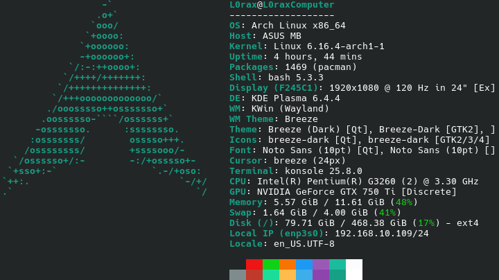
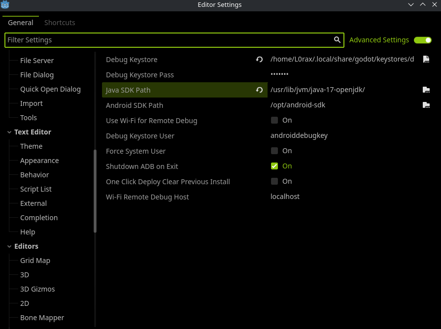
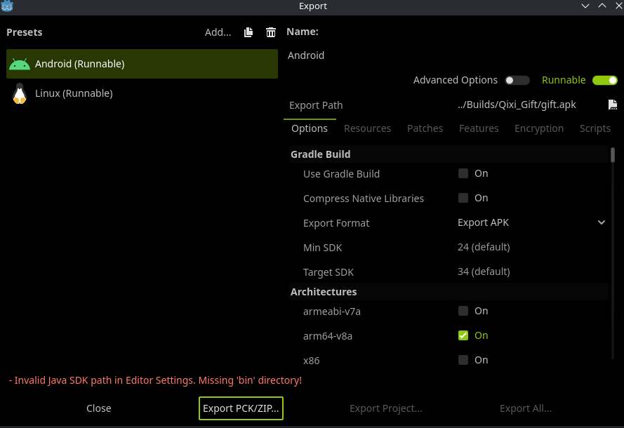
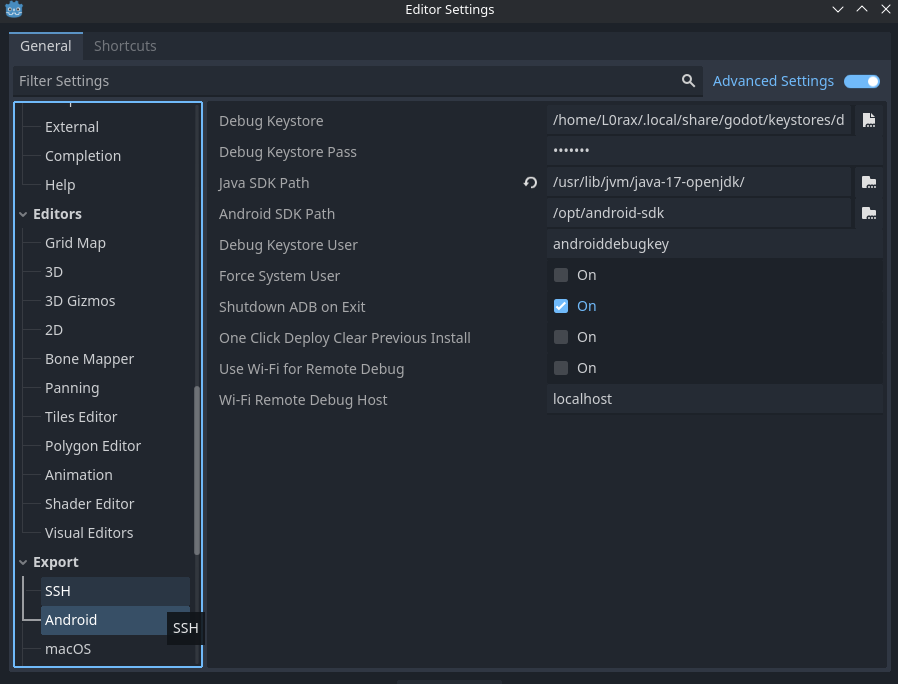
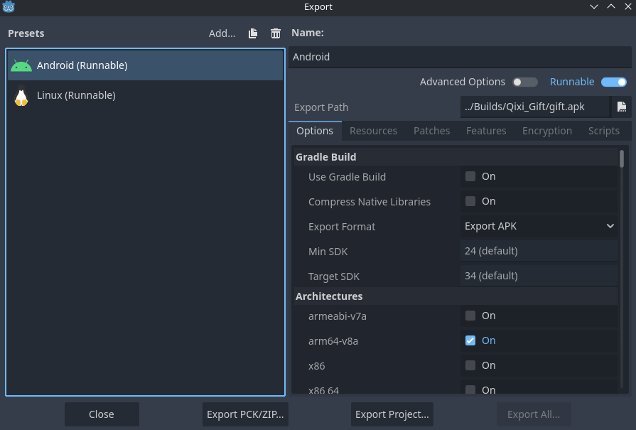

# Issue: Android Export Fails with JDK Path Error in Steam Version on Arch Linux
*** Date Reported: September 7, 2025 ***

---

- Operating System : ArchLinux
  
- Godot Version : Godot(Steam Version 4.4.1 stable)

---
  
## Description of the Problem 
1. When I try to export my project for Android, the process seems to complete successfully ("everything is OK"). However, the editor also displays an error message: "Invalid Java SDK path in Editor Settings. Missing 'bin' directory".I then installed Godot from the Arch Linux official repositories using the command ** sudo pacman -S godot ** . Using the exact same export settings, the version from the official repositories works without any errors.
2. The key store path selected through the file manager will not be updated in the export settings.
  
---  
### Steps to Reproduce
1. Install the Steam version of Godot on Arch Linux.
2. Set up the Android export settings (JDK, SDK, Keystore) correctly.
3. Attempt to export an Android project.
4. Can't exprot Andoid project, then the error message appears.

---  

## My Hypothesis 
I suspect the issue might be because:

- The Steam version of Godot might not be the latest build for Linux, or it might be packaged differently.
- I attempted to ensure both versions were using the same export templates, but the error persisted only in the Steam version.
- This suggests a potential bug or configuration issue specific to the Godot build distributed via Steam.

---  

### **Exact Steps to Reproduce**
1. Set up a clean installation of Arch Linux.
2. Install Steam via the command : 
    sudo pacman -S steam
3. Install the Godot Engine from the Steam client.
4. Clone the repository that demonstrates the issue:
    git clone https://github.com/xuezhaju/Qixi-Gift.git
5. Observe that the export process completes but the following error message is displayed:
6. Then you can see the error message:
    "Invalid Java SDK path in Editor Settings. Missing 'bin' directory"

---  

### Related images
- Steam Version of Godot(4.4.1stable)
  
  

- Godot by command installed
  
  